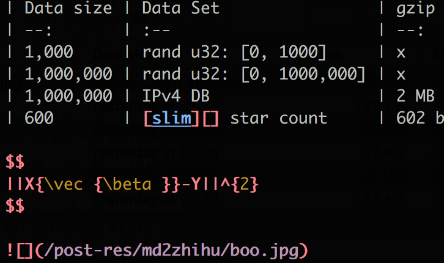
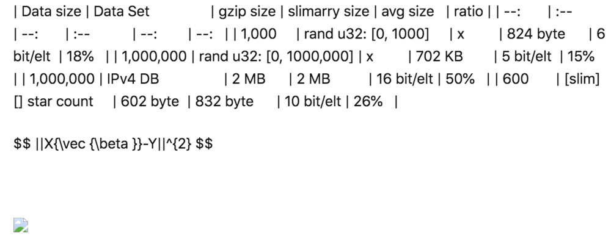
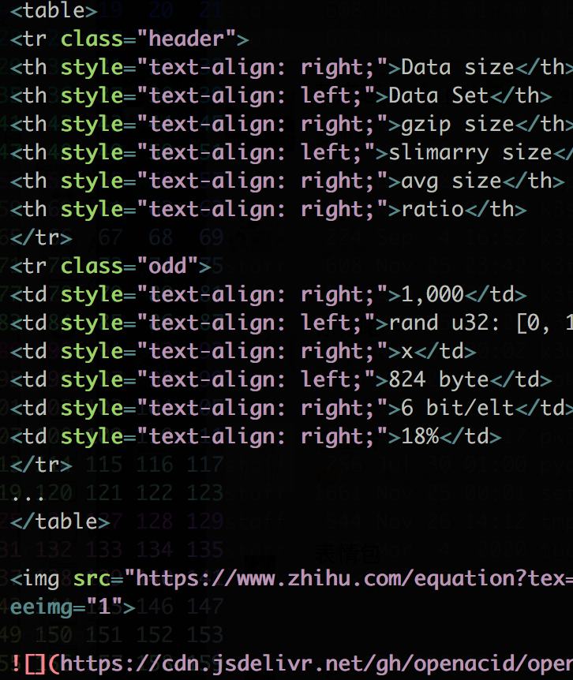
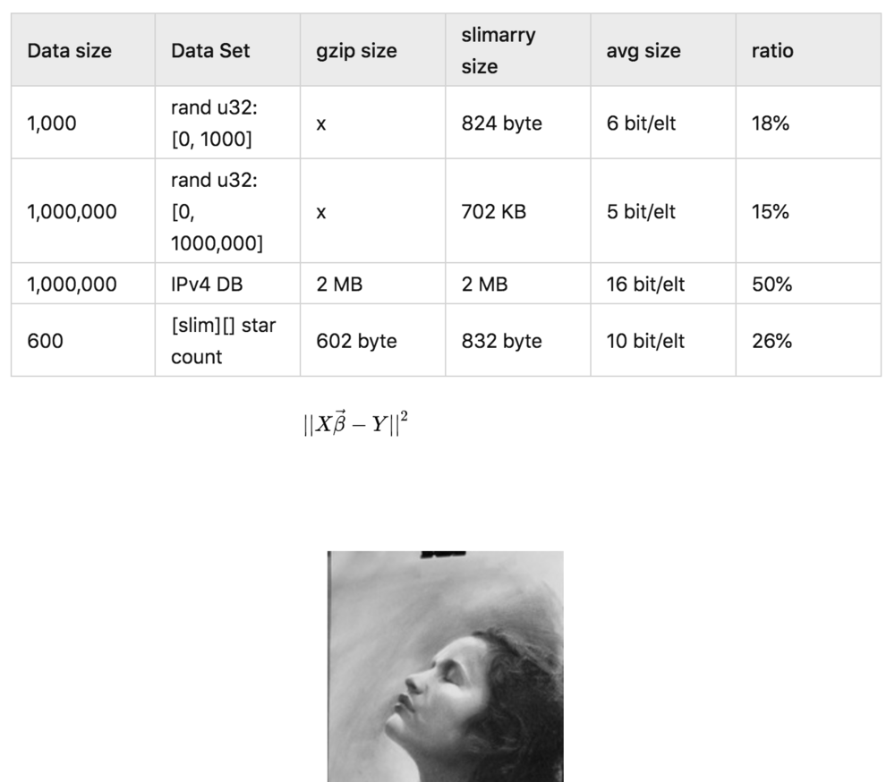
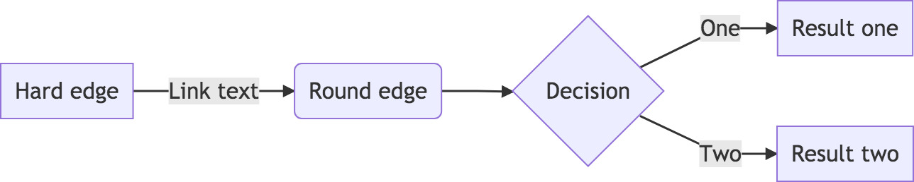
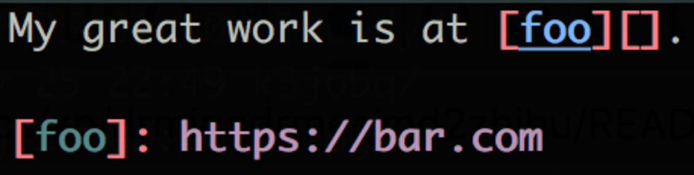
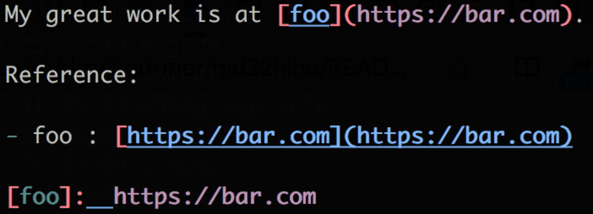
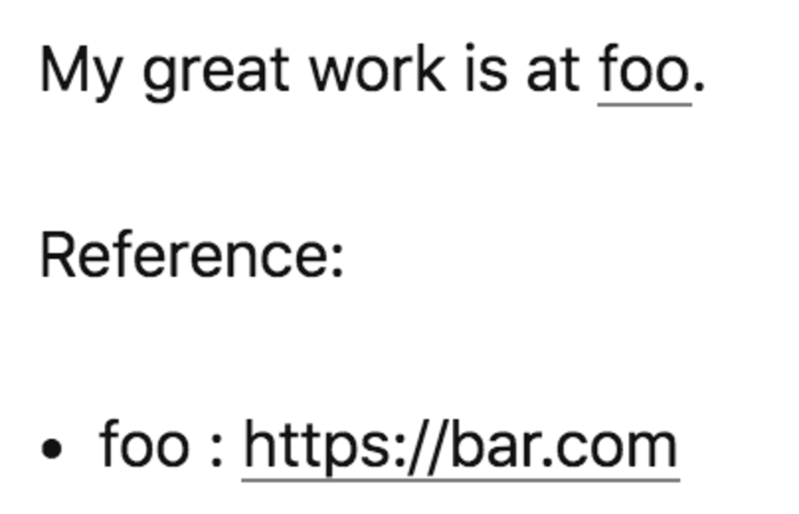

# md2zhihu

Converts markdown to a single-file version that has no local asset dependency
and can be imported into [zhihu.com](zhihu.com) or other social platform with just one click.

[md2zhihu on Marketplace](https://github.com/marketplace/actions/md2zhihu)

|           | md                    | imported               |
| :--       | :-:                   | :-:                    |
| original  |     |  |
| converted |  |   |

# Usage

## 1. Use it remotely with github-action:

This is the recommended way since you do not need install anything locally, just
a `git` is quite enough.  See: [md2zhihu on Marketplace](https://github.com/marketplace/actions/md2zhihu)

Add action config into the git repo you have markdowns to convert:
`.github/workflows/md2zhihu.yml`:

```yaml
name: md2zhihu
on: [push]
jobs:
  md2zhihu:
    runs-on: ubuntu-latest
    steps:
    - uses: actions/checkout@v2
    - uses: drmingdrmer/md2zhihu@v0.12
      env:
        GITHUB_USERNAME: ${{ github.repository_owner }}
        GITHUB_TOKEN: ${{ secrets.GITHUB_TOKEN }}
      with:
        pattern: >
            _posts/*.md
            _posts/*.markdown
```

The conversion will be triggered on next push:

It will convert markdowns in dir `_posts/` and save them in dir `_md2zhihu`.

A new branch `master-md2zhihu` containing these output will be created:

Branch `master`:
```
▾ _posts/
    2013-01-31-jobq.markdown
    2013-01-31-resource.markdown
    ...
```

Branch `master-md3zhihu`:
```
▾ _posts/
    2013-01-31-jobq.md
    2013-01-31-resource.md
    ...
▾ _md2zhihu/
    jobq.md
    resource.md
    ...
```

E.g., one of the converted [single-file example](https://github.com/drmingdrmer/drmingdrmer.github.io/blob/master/_md2zhihu/dict-cmp.md) has all its assets stored
remotely on github, thus it can be safely used everywhere, without worrying
about dealing with its dependency assets.

There are two ways to get the converted markdowns:
- `git fetch` and `git merge` the branch `master-md2zhihu`.
- Or access this branch directly on the web:
  [single-file example](https://github.com/drmingdrmer/drmingdrmer.github.io/blob/master/_md2zhihu/dict-cmp.md)

**Action Options for md2zhihu**

-   `pattern`:

    file pattern to convert

    **required**: True
    **default**: `**/*.md`

-   `output_dir`:

    dir to store converted markdown

    **required**: True
    **default**: `_md2zhihu`

-   `asset_branch`:

    The branch name in which assets are stored.

    **required**: True
    **default**: `_md2zhihu/asset`

-   `target_platform`:

    The platform that the converted markdown should be compatible toṫCurrently supported platforms are zhihu, wechat, weibo, simple. `simple` converts almost everything to images and removes most text styles. E.g. inline code block is converted to normal text.

    **required**: True
    **default**: `zhihu`


## 2. Use it on your laptop

**System requirements**

MaxOS

```sh
# For rendering table to html
brew install pandoc imagemagick node
npm install -g @mermaid-js/mermaid-cli
pip install md2zhihu
```

**Basic usage**:

In a git working dir that contains markdowns to convert:

```sh
md2zhihu your_great_work.md -r .
```

This command converts `your_great_work.md` to `_md2/your_great_work.md`.
And the assets it references are uploaded to the git repo found in current dir.


**Use another git to store assets**:

```
md2zhihu your_great_work.md -r git@github.com:drmingdrmer/md2test.git@test
```

And you need **write access** on the git repo otherwise the assests can not be
uploaded.

**Other options**: `md2zhihu --help`

### Trouble shoot

**command not found: md2zhihu**

- `pip install --verbose md2zhihu` Confirm that install done successfully.
- `which md2zhihu` Confirm that the binary can be found: e.g.: `/Users/drdrxp/xp/py3virtual/p38/bin/md2zhihu`.
- `echo $PATH` Confirmat that the install path is included in `PATH`: `...:/Users/drdrxp/xp/py3virtual/p38/bin:...`

# Features

- Transform latex to image:

  E.g. ` $$ ||X{\vec {\beta }}-Y||^{2} $$ ` is converted to 
  

- Transform table to HTML.

- Upload images to specified git repo.

- Transform mermaid code block to image:

    ```mermaid
    graph LR
        A[Hard edge] -->|Link text| B(Round edge)
        B --> C{Decision}
        C -->|One| D[Result one]
        C -->|Two| E[Result two]
    ```

    is converted to:

    


- Transform graphviz code block to image:

    ```graphviz
    digraph R {
        node [shape=plaintext]
        rankdir=LR
        X0X0 [ label="0-0"]
        X0X0 -> X1X0 [ color="#aaaadd"]
        X0X0 -> X2X3 [ color="#aaaadd"]
    }
    ```
    is converted to:

    


-   Generate link list::

    | original | converted | imported |
    | :-: | :-: | :-: |
    |  |  |  |


# Limitation

- zhihu.com does not support markdown syntax inside a table cell.
  These in-table-cell content are transformed into plain text.

- md2zhihu can not deal with jekyll/github page tags. E.g. ``.
