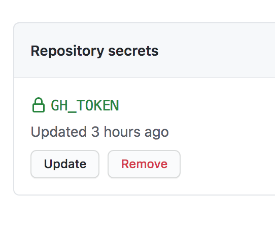

## Generate token

A token is required to let md2zhihu to push converted markdowns back to the
repo. To generate a token, follow the link:
https://github.com/settings/tokens/new

And follow steps described here:
https://docs.github.com/cn/github/authenticating-to-github/creating-a-personal-access-token

A generated token can been seen here:
https://github.com/settings/tokens

## Add token to repo

Name the generated token `GH_TOKEN` and add it to the repo that contains
original markdowns, so that md2zhihu is able to push converted markdown back to
this repo:

On the home page of the repo, follow the menu:
setting-Secrets-New repository secret.

E.g., the secret token for my blog:
https://github.com/drmingdrmer/drmingdrmer.github.io/settings/secrets/actions

