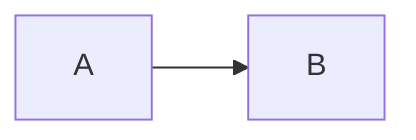
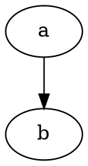

---

refs:
    - "slim":      https://github.com/openacid/slim "slim"

---

# Transparent Test

Table should pass through:

|  | col1 | col2 |
|:--| :-: | :-: |
| row1 | a | b |
| row2 | c | d |





Inline math $$ x = y $$ should pass through.

Block math:

$$
\sum_{i=1}^{n} i = \frac{n(n+1)}{2}
$$

Code block:

```go
func main() {
    fmt.Println("hello")
}
```

Image should be processed:


Reference link [slim][] should pass through unchanged.
