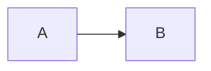
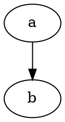

# Transparent Test

Table should pass through:

|  | col1 | col2 |
| :-- | :-: | :-: |
| row1 | a | b |
| row2 | c | d |





Inline math $$ x = y $$ should pass through.

Block math:

$$
\sum_{i=1}^{n} i = \frac{n(n+1)}{2}
$$

Code block:

```go
func main() {
    fmt.Println("hello")
}
```

Image should be processed:


Reference link [slim](https://github.com/openacid/slim) should pass through unchanged.


Reference:

- slim : [https://github.com/openacid/slim](https://github.com/openacid/slim)


[slim]: https://github.com/openacid/slim "slim"