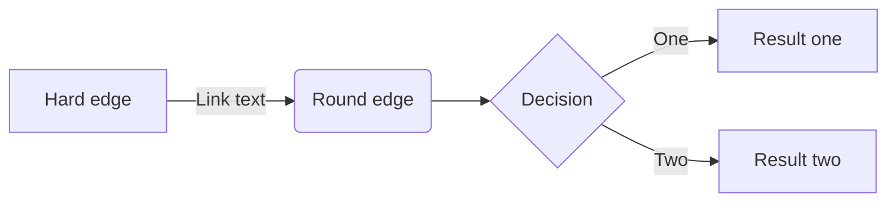

---

refs:
    - "slim":      https://github.com/openacid/slim "slim"
    - "slimarray": https://github.com/openacid/slimarray "slimarray"
    - "vlink": https://vlink "vlink"

platform_refs:
    zhihu:
        - "vlink": https://vlink.zhihu "vlink"

---

# 场景和问题

|       | md源文件 | 导入知乎的效果 |
|:--    | :-:      | :-:            |
|使用前 | a        |  c             |
|转换后 | b        |  d             |



例如 ` $$ ||X{\vec {\beta }}-Y||^{2} $$ `


在时序数据库, 或列存储为基础的系统中, 很常见的形式就是存储一个整数数组,
例如 [slim] 这个项目按天统计的 star 数:


我们可以利用数据分布的特点, 将整体数据的大小压缩到**几分之一**.

| Data size | Data Set                | gzip size | slimarry size | avg size   | ratio |
| --:       | :--                     | --:       | :--           | --:        | --:   |
| 1,000     | rand u32: [0, 1000]     | x         | 824 byte      | 6 bit/elt  | 18%   |
| 1,000,000 | rand u32: [0, 1000,000] | x         | 702 KB        | 5 bit/elt  | 15%   |
| 1,000,000 | IPv4 DB                 | 2 MB      | 2 MB          | 16 bit/elt | 50%   |
| 600       | [slim][] star count     | 602 byte  | 832 byte      | 10 bit/elt | 26%   |

在达到gzip同等压缩率的前提下, 构建 slimarray 和 访问的性能也非常高:
- 构建 slimarray 时, 平均每秒可压缩 6百万 个数组元素;
- 读取一个数组元素平均花费 7 ns/op.
    - 构建 slimarray 时, 平均每秒可压缩 6百万 个数组元素;
    - 读取一个数组元素平均花费 `7 ns/op`.

🤔!!!

按照这种思路, **在给定数组中找到一条曲线来描述点的趋势,**
**再用一个比较小的delta数组修正曲线到实际点的距离, 得到原始值, 就可以实现大幅度的数据压缩. 而且所有的数据都无需解压全部数据就直接读取任意一个.**

# 找到趋势函数

寻找这样一条曲线就使用线性回归,
例如在 [slimarray] 中使用2次曲线 `f(x) = β₁ + β₂x + β₃x²`, 所要做的就是确定每个βᵢ的值,
以使得`f(xⱼ) - yⱼ`的均方差最小. xⱼ是数组下标0, 1, 2...; yⱼ是数组中每个元素的值.

$$
X = \begin{bmatrix}
1      & x_1    & x_1^2 \\
1      & x_2    & x_2^2 \\
\vdots & \vdots & \vdots    \\
1      & x_n    & x_n^2
\end{bmatrix}
,

\vec{\beta} =
\begin{bmatrix}
\beta_1 \\
\beta_2 \\
\beta_3 \\
\end{bmatrix}
,

Y =
\begin{bmatrix}
y_1 \\
y_2 \\
\vdots \\
y_n
\end{bmatrix}
$$


`spanIndex = OnesCount(bitmap & (1<<(i/16) - 1))`

## 读取过程

读取过程通过找span, 读取span配置,还原原始数据几个步骤完成, 假设 slimarray 的对象是`sa`:

- 通过下标`i` 得到 spanIndex: `spanIndex = OnesCount(sa.bitmap & (1<<(i/16) - 1))`;
- 通过 spanIndex 得到多项式的3个系数: `[b₀, b₁, b₂] = sa.polynomials[spanIndex: spanIndex + 3]`;
- 读取 delta 数组起始位置, 和 delta 数组中每个 delta 的 bit 宽度: `config=sa.configs[spanIndex]`;
- delta 的值保存在 delta 数组的`config.offset + i*config.width`的位置, 从这个位置读取`width`个 bit 得到 delta 的值.
- 计算 `nums[i]` 的值: `b₀ + b₁*i + b₂*i²` 再加上 delta 的值.

简化的读取逻辑如下:

```go
func (sm *SlimArray) Get(i int32) uint32 {

    x := float64(i)

    bm := sm.spansBitmap & bitmap.Mask[i>>4]
    spanIdx := bits.OnesCount64(bm)

    j := spanIdx * polyCoefCnt
    p := sm.Polynomials
    v := int64(p[j] + p[j+1]*x + p[j+2]*x*x)

    config := sm.Configs[spanIdx]
    deltaWidth := config & 0xff
    offset := config >> 8

    bitIdx := offset + int64(i)*deltaWidth

    d := sm.Deltas[bitIdx>>6]
    d = d >> uint(bitIdx&63)

    return uint32(v + int64(d&bitmap.Mask[deltaWidth]))
}
```

formula in list:

-   对奇数节点, n = 2k+1, 还是沿用 **多数派** 节点的集合, 大部分场合都可以很好的工作:

    $$
    Q_{odd}(C) = M(C) = \{ q : q \subseteq C,  |q| > |C|/2 \}
    $$


-   对偶数节点, n = 2k, **因为n/2个节点跟n/2+1个节点一定有交集**,
    我们可以向 M(C) 中加入几个大小为 n/2 的节点集合,

    以本文的场景为例,
    -   可以设置 Q' = M(abcd) ∪ {ab, bc, ca}, Q'中任意2个元素都有交集;
    -   也可以是 Q' = M(abcd) ∪ {bc, cd, bd};

    要找到一个更好的偶节点的 quorum 集合, 一个方法是可以把偶数节点的集群看做是一个奇数节点集群加上一个节点x:
    $$ D = C \cup \{x\} $$

    于是偶数节点的 quorum 集合就可以是 M(D) 的一个扩张:

    $$
    Q_{even}(D)_x = M(D) \cup M(D \setminus \{x\})
    $$

    当然这个x可以随意选择, 例如在abcd的例子中, 如果选x = d, 那么
    Q' = M(abcd) ∪ {ab, bc, ca};

table in list:

-   链接列表:

    | 源文件 | 转换后 | 导入后 |
    | :-: | :-: | :-: |
    |  | fo | bar |
    | a | b | c |

no lang code:

```
123456789 123456789 123456789 123456789 123456789 123456789 123456789 123456789 
y = 1003.6 + 1.4x
num[0] = y(0) + 3 = 1006
num[1] = y(1) + 0 = 1005
num[2] = y(2) + 1 = 1007
num[3] = y(3) + 3 = 1010
                                                (3, 1010)

                                                        ....
                                                   .....
                                             ......
                                    (2, 1007)
                                  ......
            (0, 1006)       ......
                       .(1, 1005)
                 ......
            .....
      ......
......
```

[text-ref]: https://foo.com
